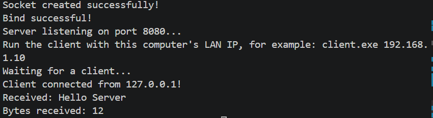
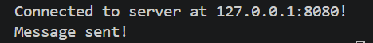

# TCP Chat Server

A simple TCP chat server and client implemented in C++ using Winsock.

## Features

- TCP socket communication
- Client-server architecture
- Message sending and receiving
- Git version control

## Technologies

- C++
- Winsock2
- Git
- GitHub

## Build

g++ server.cpp -o server -lws2_32
g++ client.cpp -o client -lws2_32

## Run

Server:
.\server.exe

Client:
.\client.exe

